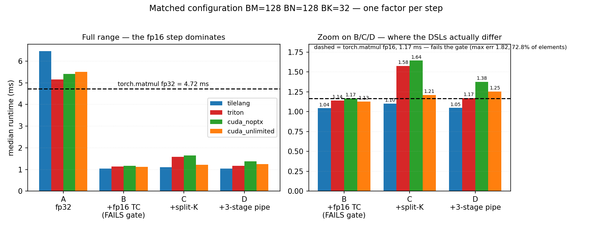
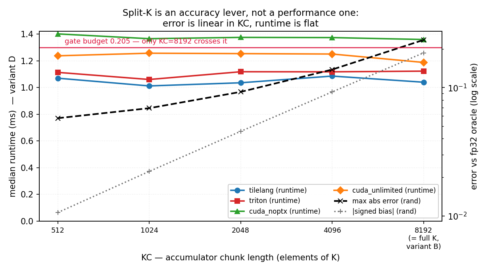
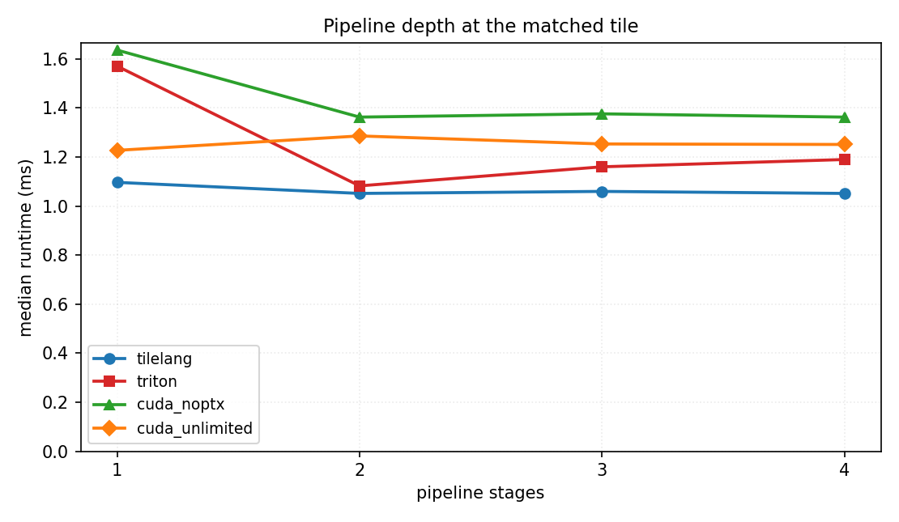

# Phase 1 — the decisive standard-matmul experiment

*Branch `cross-dsl-6op-ncu-redo`. Host: 4× NVIDIA RTX 6000 Ada (sm_89, 142 SMs,
48 GB, 96 MB L2), torch 2.10.0+cu128, triton 3.6.0, tilelang 0.1.11, nvcc
13.1.115, ncu 2026.2.1.0.*

## What this answers

`SIX_OP_ANSWERS.md` reports a cross-DSL GEMM spread of
`cuda_noptx 0.59 → triton 0.79 → cuda_unlimited 1.11 → tilelang 4.13`
and attaches a fairness caveat saying the spread "is not a clean capability
ranking until re-benched at normalized precision," and that the `cuda_noptx`
floor "is not backed by a tried-and-failed fp16-WMMA experiment and should be
read as **unsettled**."

This is that experiment. The same four kernels are implemented in all four DSLs
and exactly one thing changes at a time.

| | arithmetic | K accumulation | pipeline | isolates |
|---|---|---|---|---|
| **A** | fp32, no tensor cores | one chain over all K | DSL-native | baseline |
| **B** | fp16 TC → fp32 acc | one chain over all K | off (1 stage) | fp16 tensor-core throughput *and* its error |
| **C** | fp16 TC → fp32 acc | `KC=2048` chunk flush | off (1 stage) | split-K |
| **D** | fp16 TC → fp32 acc | `KC=2048` chunk flush | 3 stages | software pipelining |

Matched geometry `BM=128, BN=128, BK=32, threads=256`, plain 2-D grid, **no**
block swizzle, **no** cross-block split-K, **no** autotuning, operands pre-cast
to fp16 outside the timed region.

---

## 0. The controls actually hold — and one of them is unusually strong

Before any conclusion, the evidence that the experiment is controlled.

**All four DSLs produce bit-identical output at every variant.** TileLang
`T.gemm`, Triton `tl.dot`, CUDA WMMA C++ and hand-written `mma.sync` PTX agree to
the last bit on A, B, C and D:

```
variant A: vs tilelang -> triton=bitwise  cuda_noptx=bitwise  cuda_unlimited=bitwise
variant B: vs tilelang -> triton=bitwise  cuda_noptx=bitwise  cuda_unlimited=bitwise
variant C: vs tilelang -> triton=bitwise  cuda_noptx=bitwise  cuda_unlimited=bitwise
variant D: vs tilelang -> triton=bitwise  cuda_noptx=bitwise  cuda_unlimited=bitwise
```

Three consequences:

1. Accumulation structure is matched exactly, so **accuracy is a function of
   `(variant, KC)` alone — it is DSL-invariant.** The precision study therefore
   needs measuring once, not four times.
2. **Every runtime difference at D is pure code generation**, with numerics held
   bit-exactly constant.
3. C and D are bit-identical *within* each DSL, so the pipeline changes
   scheduling and never arithmetic — `D/C` is a clean performance measurement.

**Variant A is genuinely tensor-core-free** in all four lanes (SASS `HMMA=0`,
`FFMA>0`; ncu `sm__inst_executed_pipe_tensor_op_hmma = 0`), so the A-vs-B step is
valid rather than a tf32-vs-fp16 comparison in disguise.

**The kernels really compute the whole GEMM.** Independent adversarial
verification per lane: an exact permutation one-hot test returns `B[perm]`
bit-for-bit (`cuda_noptx`); ncu FFMA counts equal exactly `M·N·K = 2^36` on A and
exactly 33,554,432 `m16n8k16` MMAs on D; results are rejected against a half-K
partial sum by 1096 absolute. No lane calls `torch.matmul`, `nn.Linear` or cuBLAS.

---

## 1. Measurement protocol, and why it is not the harness default

The existing study's numbers are cross-run speedups against a reference measured
in a different process. That denominator is not stable here:
`standard_matrix_multiplication/tilelang/convergence.csv` logs `runtime=1.07 ms`
at `speedup=4.187`, implying a 4.48 ms reference, while the triton cell's identity
row implies 6.08 ms for the same reference — **a 36% swing in the denominator.**
Every number below is instead an absolute runtime, with `torch.matmul` re-measured
as just another variant in the same campaign.

**Thermal soak, not a warmup ramp.** An adversarial verifier observed variant D
returning 0.657 / 1.033 / 1.034 ms across three identical invocations. Probing it
(`stability.py`, 5–6 independent processes per point):

| warmup | process spread | within-process drift | median |
|---|---|---|---|
| 50 iters | **27.6%** | +19% to +29% on 3 of 6 processes | 0.886 ms |
| 200 iters | 10.2% | −2 to −4%, one +11% outlier | 0.923 ms |
| 500 iters | 4.9% | uniformly −2 to −5% | 0.939 ms |
| 1000 iters | 2.4% | −0.1 to −3.7% | 1.023 ms |
| **2.0 s (fixed time)** | **3.5%** | −1.2 to −3.5% | 0.999 ms |

At shallow warmup several processes start *fast* (~0.67 ms) and get *slower*
(~0.83 ms): a cold-card transient boost decaying to sustained clocks. The
verifier's 0.657 ms was that transient, not a steady state. The median rises
monotonically with warmup depth — the card is thermally soaking, and there is no
true steady state to find.

This forces a protocol choice: **warm for a fixed wall-clock time, not a fixed
iteration count.** Variant A runs ~4.5× longer than D, so a fixed iteration count
delivers ~4.5× more heat before the slow variant is measured than before the fast
one — which would bias the comparison toward whichever variant is already fast.

Frozen protocol for every number in this report:

- `--warmup-s 2.0`, `--trials 100`, cuda-event timed, L2 thrashed before each trial
- **5 independent processes** per point; one variant per process (JIT caches,
  cuBLAS workspaces and allocator state leak between variants inside a process)
- reported value = **median of per-process medians**; interval = full range plus a
  t-based 95% CI on the mean of those medians
- **randomized order** over (job × repeat), fixed seed, reproducible
- serialized on one **idle** GPU; `driver.py` aborts if the card has any other
  compute process, because contamination is undetectable after the fact
- compile time measured separately and never inside a timing

The harness's own 200-iteration warmup was chosen for memory-bound ops; for a
~1 ms GEMM it is 0.2 s of work and lands mid-transient.

**Anchor check — did the campaigns drift?** Every sub-study contains a point that is also variant D at the primary geometry. The campaigns ran hours apart on a card that thermally soaks, so agreement here is what licenses reading the sub-study tables against the matched table at all.

| DSL | matched D | pipeline @ stages=3 | casting @ precast | kc_sweep @ KC=2048 | drift (5-proc only) |
|---|---|---|---|---|---|
| tilelang | 1.048 | 1.060 | 1.060 | 1.035 *(n=3)* | 1.2% |
| triton | 1.171 | 1.160 | 1.171 | 1.118 *(n=3)* | 1.0% |
| cuda_noptx | 1.376 | 1.376 | 1.392 | 1.375 *(n=3)* | 1.1% |
| cuda_unlimited | 1.253 | 1.253 | 1.254 | 1.253 *(n=3)* | 0.1% |

Across the campaigns that ran at the full reporting protocol, worst disagreement is **1.2%** against a 3.5% between-process noise floor. **The card did not drift**, and the sub-study tables may be read against the matched table without correction.

The KC sweep ran at 3 processes rather than 5 (40 points × 5 would have doubled the campaign), and it is the only column that disagrees more — up to 4.8%. That is the cost of the smaller sample, not card drift: the 5-process campaigns agree with each other to 1.2%. It is also a direct demonstration of why the protocol requires five processes, so the KC *runtimes* are read only as a flat-vs-not shape and never as head-to-head DSL comparisons.

---

## 2. Precision control — is the fp16 path general, or a specialization?

Two RMS-matched input distributions (both `RMS = 1/√3`, so the operands carry
identical energy; only the mean differs), 20 seeds each, measured against both the
fp32 oracle and an **fp64 ground truth**.

| | mean | ‖C‖ | gate budget `1e-4 + 1e-4·‖C‖` |
|---|---|---|---|
| `torch.rand` (benchmark-faithful) | 0.5 | 2048 | **0.205** |
| `torch.randn × 1/√3` (zero-mean) | 0 | 24 | **0.0025** |

The same *relative* gate is **82× tighter** under `randn`. That is a property of
the benchmark's input distribution, not of any kernel.

| variant | KC | `rand` pass | max err | signed bias | `randn` pass | `randn` max err | `randn` fail % |
|---|---|---|---|---|---|---|---|
| A fp32 | — | 20/20 | 0.0147 | −2.8e−5 | **0/20** | 0.00076 | 0.004% |
| B fp16 | full-K | **0/20** | 0.2349 | **−0.1863** | 0/20 | 0.0525 | 78.29% |
| C fp16 | 512 | 20/20 | 0.0577 | −0.0106 | 0/20 | 0.0528 | 78.26% |
| C fp16 | 1024 | 20/20 | 0.0691 | −0.0222 | 0/20 | 0.0528 | 78.26% |
| C fp16 | 2048 | 20/20 | 0.0925 | −0.0456 | 0/20 | 0.0528 | 78.26% |
| C fp16 | 4096 | 20/20 | 0.1381 | −0.0925 | 0/20 | 0.0527 | 78.27% |
| C fp16 | 8192 | **0/20** | 0.2349 | −0.1863 | 0/20 | 0.0525 | 78.29% |
| D fp16 | 2048 | 20/20 | 0.0925 | −0.0456 | 0/20 | 0.0528 | 78.26% |

### The mechanism: the bias is linear in KC

| KC | \|bias\| | ratio vs previous |
|---|---|---|
| 512 | 0.01063 | — |
| 1024 | 0.02224 | 2.09× |
| 2048 | 0.04562 | 2.05× |
| 4096 | 0.09249 | 2.03× |
| 8192 | 0.1863 | 2.01× |

A random walk of independent round-offs grows as √KC (**1.41× per doubling**); a
systematic drift grows as KC (**2.00× per doubling**). Measured: 2.09 → 2.05 →
2.03 → 2.01, converging on exactly 2.00. **The fp16 error is a systematic
accumulation drift, and split-K works by shortening the chain.** `C@KC=8192`
reproduces `B` exactly, so the sweep self-anchors.

This independently reproduces `SIX_OP_ANSWERS.md`'s claim of "~−0.19 at K=8192…
cutting it to −0.02": measured **−0.1863** and **−0.0222**, by a different
implementation.

### Four findings

1. **Split-K is an accuracy enabler, not a performance lever.** It converts a
   14%-over-budget FAIL into a 2.4×-under-budget PASS, and it *costs* runtime
   (§3).
2. **Under zero-mean inputs split-K buys nothing.** The `randn` bias is −2.3e−7 at
   every KC — there is no systematic drift to remove — and max error is flat at
   ~0.0528 regardless of chunk size. Split-K is not a general accuracy technique;
   **it is a fix for an artifact the all-positive input distribution creates.**
3. **The fp16 path is a specialization on the benchmark's distribution.** It fails
   `randn` by ~21× at every KC, with 78.26–78.29% of elements out of budget. This
   independently reproduces the "79% of elements fail" figure in
   `SIX_OP_ANSWERS.md`.
4. **But `randn` is not a drop-in fairer gate.** The *fp32* kernel also fails it
   (0/20, 0.004% of elements): under zero-mean outputs many elements sit near
   zero, where a 1e-4 *relative* budget collapses to ~1e-4 absolute, which mere
   accumulation *reordering* violates. A corrected control needs an absolute-error
   floor. That said, fp16's 78.29% failure is ~20,000× worse than fp32's 0.004%,
   so **fp16's disqualification under zero-mean inputs is real, not a gate
   artifact.**

### The oracle is not exact either

| dist | oracle max err vs fp64 | oracle bias vs fp64 | gate budget |
|---|---|---|---|
| `rand` | 0.00519 | −5.49e−6 | 0.205 |
| `randn` | 0.00027 | −2.31e−9 | 0.0025 |

`torch.matmul` fp32 is itself 0.0052 from truth under `rand` — 2.5% of the gate
budget — but essentially **unbiased**. That is why the fp16 full-K chain's −0.186
systematic drift shows up so sharply against it: the reference does not share the
drift.

---

## 3. The matched-configuration table



*170 process records, 170 successful.*

### Matched configuration — geom=primary, inputs=rand

Absolute median runtime in ms (median of per-process medians). ✓/✗ = passes / fails the harness gate `|ref−got| ≤ 1e-4 + 1e-4·|ref|`.

| DSL | A<br><sub>fp32 / full-K / native pipe</sub> | B<br><sub>fp16 TC / full-K / no pipe</sub> | C<br><sub>fp16 TC / KC=2048 / no pipe</sub> | D<br><sub>fp16 TC / KC=2048 / 3-stage pipe</sub> |
|---|---|---|---|---|
| torch | 4.717 ✓ | 1.168 ✗ | — | — |
| tilelang | 6.462 ✓ | 1.042 ✗ | 1.102 ✓ | 1.048 ✓ |
| triton | 5.152 ✓ | 1.140 ✗ | 1.577 ✓ | 1.171 ✓ |
| cuda_noptx | 5.407 ✓ | 1.166 ✗ | 1.642 ✓ | 1.376 ✓ |
| cuda_unlimited | 5.508 ✓ | 1.128 ✗ | 1.210 ✓ | 1.253 ✓ |

### Achieved TFLOP/s (2·M·N·K ÷ median runtime)

| DSL | A | B | C | D |
|---|---|---|---|---|
| torch | 29.1 | 117.6 | — | — |
| tilelang | 21.3 | 131.8 | 124.7 | 131.2 |
| triton | 26.7 | 120.6 | 87.2 | 117.3 |
| cuda_noptx | 25.4 | 117.9 | 83.7 | 99.9 |
| cuda_unlimited | 25.0 | 121.8 | 113.6 | 109.7 |

### Decomposition — each step isolates one factor

Speedup of the later variant over the earlier one, derived from the medians above. >1 means the step made it faster.

| DSL | B/A<br><sub>fp16 tensor cores</sub> | C/B<br><sub>split-K chunk flush</sub> | D/C<br><sub>software pipeline</sub> | D/A<br><sub>total</sub> |
|---|---|---|---|---|
| torch | 4.04× | — | — | — |
| tilelang | 6.20× | 0.95× | 1.05× | 6.17× |
| triton | 4.52× | 0.72× | 1.35× | 4.40× |
| cuda_noptx | 4.64× | 0.71× | 1.19× | 3.93× |
| cuda_unlimited | 4.88× | 0.93× | 0.97× | 4.39× |

### Error against the fp32 oracle — inputs=rand

| DSL | variant | max abs err | gate budget | % elems failing | signed bias | gate |
|---|---|---|---|---|---|---|
| torch | A | 0 | ~0.205 | 0.0000% | +0 | PASS |
| torch | B | 1.821 | ~0.205 | 72.7576% | -0.071 | FAIL |
| tilelang | A | 0.01416 | ~0.205 | 0.0000% | -2.79e-05 | PASS |
| tilelang | B | 0.2334 | ~0.205 | 1.0964% | -0.1862 | FAIL |
| tilelang | C | 0.08618 | ~0.205 | 0.0000% | -0.04552 | PASS |
| tilelang | D | 0.08618 | ~0.205 | 0.0000% | -0.04552 | PASS |
| triton | A | 0.01416 | ~0.205 | 0.0000% | -2.79e-05 | PASS |
| triton | B | 0.2334 | ~0.205 | 1.0964% | -0.1862 | FAIL |
| triton | C | 0.08618 | ~0.205 | 0.0000% | -0.04552 | PASS |
| triton | D | 0.08618 | ~0.205 | 0.0000% | -0.04552 | PASS |
| cuda_noptx | A | 0.01416 | ~0.205 | 0.0000% | -2.79e-05 | PASS |
| cuda_noptx | B | 0.2334 | ~0.205 | 1.0964% | -0.1862 | FAIL |
| cuda_noptx | C | 0.08618 | ~0.205 | 0.0000% | -0.04552 | PASS |
| cuda_noptx | D | 0.08618 | ~0.205 | 0.0000% | -0.04552 | PASS |
| cuda_unlimited | A | 0.01416 | ~0.205 | 0.0000% | -2.79e-05 | PASS |
| cuda_unlimited | B | 0.2334 | ~0.205 | 1.0964% | -0.1862 | FAIL |
| cuda_unlimited | C | 0.08618 | ~0.205 | 0.0000% | -0.04552 | PASS |
| cuda_unlimited | D | 0.08618 | ~0.205 | 0.0000% | -0.04552 | PASS |

### Measurement quality — per-process spread

| key | n proc | median ms | min–max ms | 95% CI ms | spread % | compile s |
|---|---|---|---|---|---|---|
| torch/A | 5 | 4.7171 | 4.6597–4.7176 | 4.674–4.738 | 1.2 | 0.1 |
| torch/B | 5 | 1.1684 | 1.1510–1.1694 | 1.155–1.175 | 1.6 | 0.1 |
| tilelang/A | 5 | 6.4625 | 6.3580–6.4645 | 6.384–6.501 | 1.6 | 10.4 |
| tilelang/B | 5 | 1.0424 | 1.0035–1.0629 | 1.011–1.066 | 5.7 | 4.1 |
| tilelang/C | 5 | 1.1018 | 1.0864–1.1121 | 1.088–1.111 | 2.3 | 4.0 |
| tilelang/D | 5 | 1.0476 | 1.0220–1.0598 | 1.028–1.066 | 3.6 | 4.8 |
| triton/A | 5 | 5.1517 | 5.0600–5.2014 | 5.071–5.217 | 2.7 | 0.4 |
| triton/B | 5 | 1.1397 | 1.1351–1.1505 | 1.134–1.149 | 1.3 | 0.4 |
| triton/C | 5 | 1.5769 | 1.5673–1.5872 | 1.566–1.585 | 1.3 | 0.4 |
| triton/D | 5 | 1.1715 | 1.1602–1.1837 | 1.162–1.183 | 2.0 | 0.4 |
| cuda_noptx/A | 5 | 5.4066 | 5.2500–5.4282 | 5.283–5.463 | 3.3 | 0.2 |
| cuda_noptx/B | 5 | 1.1658 | 1.1367–1.1798 | 1.138–1.182 | 3.7 | 0.2 |
| cuda_noptx/C | 5 | 1.6424 | 1.6208–1.6476 | 1.625–1.652 | 1.6 | 0.2 |
| cuda_noptx/D | 5 | 1.3763 | 1.3619–1.4060 | 1.355–1.410 | 3.2 | 0.2 |
| cuda_unlimited/A | 5 | 5.5076 | 5.4810–5.5660 | 5.475–5.553 | 1.5 | 0.2 |
| cuda_unlimited/B | 5 | 1.1279 | 1.1131–1.1412 | 1.116–1.143 | 2.5 | 0.2 |
| cuda_unlimited/C | 5 | 1.2103 | 1.2042–1.2406 | 1.199–1.238 | 3.0 | 0.2 |
| cuda_unlimited/D | 5 | 1.2534 | 1.2012–1.2800 | 1.206–1.285 | 6.3 | 0.2 |

### Secondary geometry (BM=128 BN=256 BK=32)

Carried so no conclusion is hostage to one tile shape.

Absolute median runtime in ms (median of per-process medians). ✓/✗ = passes / fails the harness gate `|ref−got| ≤ 1e-4 + 1e-4·|ref|`.

| DSL | A<br><sub>fp32 / full-K / native pipe</sub> | B<br><sub>fp16 TC / full-K / no pipe</sub> | C<br><sub>fp16 TC / KC=2048 / no pipe</sub> | D<br><sub>fp16 TC / KC=2048 / 3-stage pipe</sub> |
|---|---|---|---|---|
| tilelang | 6.055 ✓ | 0.921 ✗ | 0.987 ✓ | 1.039 ✓ |
| triton | 4.727 ✓ | 1.032 ✗ | 1.422 ✓ | 1.939 ✓ |
| cuda_noptx | 5.064 ✓ | 1.171 ✗ | 1.436 ✓ | 1.515 ✓ |
| cuda_unlimited | 5.072 ✓ | 1.012 ✗ | 1.070 ✓ | 1.217 ✓ |

### Achieved TFLOP/s (2·M·N·K ÷ median runtime)

| DSL | A | B | C | D |
|---|---|---|---|---|
| tilelang | 22.7 | 149.3 | 139.2 | 132.2 |
| triton | 29.1 | 133.2 | 96.6 | 70.9 |
| cuda_noptx | 27.1 | 117.4 | 95.7 | 90.7 |
| cuda_unlimited | 27.1 | 135.8 | 128.4 | 113.0 |

### Decomposition — each step isolates one factor

Speedup of the later variant over the earlier one, derived from the medians above. >1 means the step made it faster.

| DSL | B/A<br><sub>fp16 tensor cores</sub> | C/B<br><sub>split-K chunk flush</sub> | D/C<br><sub>software pipeline</sub> | D/A<br><sub>total</sub> |
|---|---|---|---|---|
| tilelang | 6.58× | 0.93× | 0.95× | 5.83× |
| triton | 4.58× | 0.73× | 0.73× | 2.44× |
| cuda_noptx | 4.32× | 0.82× | 0.95× | 3.34× |
| cuda_unlimited | 5.01× | 0.95× | 0.88× | 4.17× |

---

## 4. Generated code — what the compilers actually emitted

Static SASS counts. **These are static, not dynamic**: a fully unrolled loop shows
a large count against a rolled loop with a large trip count, for identical
arithmetic. The bit-identical outputs prove the arithmetic is the same regardless,
and ncu confirms the dynamic MMA counts match (§6).

### Generated-code census (SASS) — what the compilers actually emitted

Static instruction counts from `cuobjdump -sass`. **These are static, not dynamic**: a fully unrolled loop shows a large count against a rolled loop with a large trip count, for identical arithmetic. The bit-identical outputs across all four DSLs prove the arithmetic is the same regardless.

| DSL | variant | HMMA | LDGSTS<br><sub>cp.async</sub> | LDSM<br><sub>ldmatrix</sub> | FFMA | regs | spill B | smem B |
|---|---|---|---|---|---|---|---|---|
| tilelang | A | 0 | 16 | 0 | 4096 | 163 | 0 | 32768 |
| tilelang | B | 64 | 8 | 24 | 0 | 131 | 0 | 16384 |
| tilelang | C | 64 | 8 | 24 | 0 | 191 | 0 | 16384 |
| tilelang | D | 2048 | 256 | 768 | 0 | 238 | 0 | 49152 |
| triton | A | 0 | 0 | 0 | 2048 | 182 | 0 | 32768 |
| triton | B | 32 | 0 | 12 | 0 | 121 | 0 | 16384 |
| triton | C | 32 | 0 | 12 | 0 | 254 | 0 | 40960 |
| triton | D | 32 | 12 | 12 | 0 | 254 | 0 | 65536 |
| cuda_noptx | A | 0 | 0 | 0 | 2048 | 128 | 0 | 32768 |
| cuda_noptx | B | 32 | 0 | 12 | 0 | 123 | 0 | 18944 |
| cuda_noptx | C | 32 | 0 | 12 | 0 | 195 | 0 | 18944 |
| cuda_noptx | D | 32 | 42 | 12 | 0 | 166 | 0 | 56832 |
| cuda_unlimited | A | 0 | 0 | 0 | 256 | 127 | 0 | 33792 |
| cuda_unlimited | B | 32 | 0 | 12 | 0 | 104 | 0 | 18944 |
| cuda_unlimited | C | 32 | 0 | 12 | 0 | 167 | 0 | 18944 |
| cuda_unlimited | D | 32 | 12 | 12 | 0 | 168 | 0 | 56832 |

Hardware counters (ncu):

| DSL | variant | ncu ms | tensor-pipe % | occupancy % | regs | smem B | DRAM MiB | L2 hit % | achieved TC TFLOP/s |
|---|---|---|---|---|---|---|---|---|---|
| tilelang | A | 4.688 | 0.0 | 16.7 | 163 | 32768 | 618 | 85.8 | 0.0 |
| tilelang | B | 0.696 | 69.2 | 16.6 | 131 | 16384 | 116 | 95.4 | 197.4 |
| tilelang | C | 0.980 | 43.4 | 16.6 | 191 | 16384 | 116 | 95.4 | 140.2 |
| tilelang | D | 0.657 | 84.5 | 16.6 | 238 | 49152 | 116 | 95.4 | 209.2 |
| triton | A | 3.435 | 0.0 | 16.7 | 182 | 32768 | 618 | 85.8 | 0.0 |
| triton | B | 0.688 | 83.9 | 32.5 | 121 | 16384 | 146 | 93.3 | 199.8 |
| triton | C | 1.541 | 27.9 | 16.7 | 254 | 40960 | 118 | 95.3 | 89.2 |
| triton | D | 0.797 | 61.4 | 16.6 | 254 | 65536 | 116 | 95.3 | 172.5 |
| cuda_noptx | A | 3.473 | 0.0 | 30.4 | 128 | 32768 | 381 | 91.4 | 0.0 |
| cuda_noptx | B | 0.918 | 42.0 | 30.1 | 123 | 18944 | 148 | 93.0 | 149.8 |
| cuda_noptx | C | 1.611 | 27.1 | 16.7 | 195 | 18944 | 117 | 95.4 | 85.3 |
| cuda_noptx | D | 0.901 | 56.6 | 16.6 | 166 | 56832 | 117 | 96.9 | 152.5 |
| cuda_unlimited | A | 3.535 | 0.0 | 30.1 | 127 | 33792 | 483 | 89.0 | 0.0 |
| cuda_unlimited | B | 0.711 | 62.0 | 30.2 | 104 | 18944 | 147 | 93.0 | 193.2 |
| cuda_unlimited | C | 1.009 | 43.1 | 16.6 | 167 | 18944 | 117 | 95.4 | 136.2 |
| cuda_unlimited | D | 0.831 | 61.3 | 16.6 | 168 | 56832 | 116 | 98.5 | 165.4 |

**The ncu duration column is not a runtime and must not be read as one.** It
disagrees with the campaign by up to 1.6×, and — the part that matters — it
disagrees about *ratios*: tilelang `D/C` is **1.49× under ncu and 1.05× in the
campaign**. Two causes, both structural:

- **Clock state.** ncu's isolated run is short and lands on the cold-card boost
  transient. It reports tilelang D at **0.657 ms**, which is exactly the
  shallow-warmup transient `stability.py` measured (§1, 0.657 ms) before the card
  soaked to ~1.03 ms. The campaign deliberately measures the soaked state.
- **Cache state.** The campaign thrashes L2 before every trial, as the harness
  does; the profiled run does not.

So every ncu number used in this report is a *counter*, not a clock: instruction
counts, utilization percentages, occupancy, registers, shared memory, stall
structure. The ranking at D happens to survive (tilelang < triton <
cuda_unlimited < cuda_noptx in both), but that is a coincidence of this workload
and is not relied on anywhere.

Reading the tensor-pipe column across A→B→C→D is the pipeline story in one line:
**the split-K flush drains the MMA pipe** (utilization collapses at C in every
lane) **and the software pipeline refills it** (recovered at D). Both effects are
present in all four DSLs.

Two structural facts:

- **Every D variant runs at ~16.6% occupancy** — 8 warps per SM out of 48, capped
  by 166–254 registers plus shared memory. None of these kernels wins on
  occupancy; they all depend on instruction-level parallelism, which is precisely
  why load scheduling dominates.
- **`stages=1` is genuinely unpipelined in triton and both CUDA lanes.** LDGSTS
  goes 0 → 12 at C→D for triton and `cuda_unlimited`, and 0 → 42 for
  `cuda_noptx` (whose `__pipeline_memcpy_async` intrinsic expands to more
  instructions for the same transfers), with HMMA held at 32 throughout.
  **TileLang differs**: `T.copy` inside `T.Pipelined(num_stages=1)` still emits
  `cp.async` (LDGSTS=8 at B and C), so tilelang's B and C are not "pipeline off"
  in the same sense as the other three. Outside a pipeline construct entirely —
  abstraction arm M1, a plain serial K loop — tilelang emits **LDGSTS=0**. The
  async-copy lowering is attached to the pipeline construct, not to `T.copy`.
  This is a caveat on tilelang's B and C numbers, and on the H1-vs-H2 comparison
  in §6.

---

## 5. Sub-studies

The KC figure is the whole split-K argument in one frame: **runtime is flat
across a 16× change in chunk length** (0.99–1.05× end to end, in every lane, with
and without the pipeline) **while max error rises 4.1×, the signed bias rises
17.5×, and the gate is crossed only at the last point.**



### KC sweep — runtime cost of the chunk flush

Absolute median ms. Pair with the error column from the precision study: error falls ~2× per halving of KC while runtime moves comparatively little, which is what makes split-K an accuracy lever rather than a performance one.


**Variant C — pipeline OFF (stages=1)**

| DSL | KC=512 | KC=1024 | KC=2048 | KC=4096 | KC=8192 | KC=512 ÷ KC=8192 |
|---|---|---|---|---|---|---|
| tilelang | 1.088 | 1.077 | 1.096 | 1.080 | 1.040 | 1.05× |
| triton | 1.591 | 1.575 | 1.566 | 1.563 | 1.569 | 1.01× |
| cuda_noptx | 1.649 | 1.621 | 1.632 | 1.628 | 1.629 | 1.01× |
| cuda_unlimited | 1.219 | 1.191 | 1.205 | 1.224 | 1.213 | 1.00× |

**Variant D — pipeline ON (stages=3)**

| DSL | KC=512 | KC=1024 | KC=2048 | KC=4096 | KC=8192 | KC=512 ÷ KC=8192 |
|---|---|---|---|---|---|---|
| tilelang | 1.070 | 1.012 | 1.035 | 1.085 | 1.040 | 1.03× |
| triton | 1.113 | 1.060 | 1.118 | 1.117 | 1.122 | 0.99× |
| cuda_noptx | 1.401 | 1.365 | 1.375 | 1.373 | 1.359 | 1.03× |
| cuda_unlimited | 1.237 | 1.256 | 1.253 | 1.250 | 1.187 | 1.04× |

### Casting control — fp16 compute vs the cost of getting to fp16

Same fp16 kernel, three input paths. `precast` = operands already fp16 (conversion outside the timed region). `in_region` = `.half()` executed inside the timed region, which is what the incumbent solution does. `on_load` = kernel reads fp32 global and converts into shared memory.

| DSL | precast | in_region | on_load | in_region − precast | on_load ÷ precast |
|---|---|---|---|---|---|
| tilelang | 1.060 | 1.268 | 1.801 | +0.208 ms | 1.70× |
| triton | 1.171 | 1.381 | 2.136 | +0.210 ms | 1.82× |
| cuda_noptx | 1.392 | 1.612 | 2.674 | +0.221 ms | 1.92× |
| cuda_unlimited | 1.254 | 1.473 | 1.860 | +0.219 ms | 1.48× |
| torch | 1.168 | 1.375 | — | +0.207 ms | — |

**The incumbent solution's own shape** (`BM=128 BN=256 BK=64`, `stages=2`, `KC=2048`) — its published form casts inside `forward()`:

| cast | median ms |
|---|---|
| in_region | 1.220 |
| precast | 0.986 |

### Pipeline depth

Everything else held at the matched configuration. For the CUDA lanes `stages=1` is a synchronous single buffer and `stages>1` is async multi-buffering.

| DSL | stages=1 | stages=2 | stages=3 | stages=4 | best ÷ stages=1 |
|---|---|---|---|---|---|
| tilelang | 1.097 | 1.052 | 1.060 | 1.052 | 1.04× |
| triton | 1.571 | 1.082 | 1.160 | 1.190 | 1.45× |
| cuda_noptx | 1.636 | 1.363 | 1.376 | 1.363 | 1.20× |
| cuda_unlimited | 1.227 | 1.286 | 1.253 | 1.251 | 1.00× |

### Equal-budget native tuning — the same configuration grid offered to every DSL

Each DSL searches an identical 19-point grid with an identical budget; its best point becomes its row. This is the counterpart to the matched table: it asks who exploits a shared search space best, rather than who is fastest at one imposed configuration. The search ran at 2 processes per point because it only has to rank; the winners are re-measured at the full protocol below.

| DSL | best configuration | median ms | vs its matched-D | vs torch fp32 | points that ran |
|---|---|---|---|---|---|
| tilelang | BM=128 BN=256 BK=64 stages=2 | 0.951 | 1.10× | 4.96× | 19 |
| triton | BM=128 BN=256 BK=32 stages=2 | 1.043 | 1.12× | 4.52× | 15 |
| cuda_noptx | BM=256 BN=128 BK=32 stages=2 | 1.235 | 1.11× | 3.82× | 19 |
| cuda_unlimited | BM=128 BN=256 BK=32 stages=4 | 1.042 | 1.20× | 4.53× | 19 |

Spread across DSLs at each one's own tuned best: **1.30×**.

**The grid was not equally available.** `triton` reached 15 of 19 points; the rest failed to build. Points a DSL cannot compile are a real property of the toolchain, but they also mean its row is the best of a smaller search — see the note under the table.
### Native-tuning winners re-measured at the full protocol

The search ran at 2 processes per point (it only has to rank); the two best points per DSL are re-measured at 5 processes, like every other reported number. A rank flip between the two columns means the search resolved below the noise floor.

| DSL | configuration | search ms (2 proc) | confirmed ms (5 proc) | 95% CI | rank held |
|---|---|---|---|---|---|
| tilelang | `BM=128,BN=256,BK=64,stages=2,kc=2048` | 0.951 | 0.978 | [0.971, 0.984] | yes |
|  | `BM=256,BN=128,BK=64,stages=2,kc=2048` | 0.958 | 0.986 | [0.976, 0.998] |  |
| triton | `BM=128,BN=256,BK=32,stages=2,kc=2048` | 1.043 | 1.078 | [1.041, 1.102] | yes |
|  | `BM=128,BN=128,BK=32,stages=2,kc=2048` | 1.051 | 1.078 | [1.058, 1.087] |  |
| cuda_noptx | `BM=256,BN=128,BK=32,stages=2,kc=2048` | 1.235 | 1.293 | [1.270, 1.315] | **NO — flipped** |
|  | `BM=128,BN=256,BK=32,stages=2,kc=2048` | 1.245 | 1.278 | [1.261, 1.287] |  |
| cuda_unlimited | `BM=128,BN=256,BK=32,stages=4,kc=2048` | 1.042 | 1.101 | [1.078, 1.116] | yes |
|  | `BM=256,BN=128,BK=32,stages=4,kc=2048` | 1.125 | 1.155 | [1.149, 1.160] |  |

**Confirmed tuned ranking:** tilelang 0.978 < triton 1.078 < cuda_unlimited 1.101 < cuda_noptx 1.278 — spread **1.31×**.

Every confirmed number is higher than its search number (+2.6% to +5.7%). That is expected: the search reports the *minimum* over ~19 two-process medians, which selects downward. The confirmed column is the one to quote.



### What the sub-studies change

**The casting cost is DSL-invariant, and it is large.** Moving `.half()` inside
the timed region costs **+0.207 to +0.221 ms in all five lanes** — including
`torch.matmul`, which shares no code with any of them. It has to be invariant:
it is the same two conversions of the same tensors, a pure bandwidth operation
that does not touch the GEMM kernel. That it comes out invariant to ±7% across
five independent implementations is a good check on the timing apparatus.

This matters for how the published numbers should be read. **KernelBench hands
`forward()` fp32 tensors**, so `precast` is not a path a real solution can take —
the conversion has to happen somewhere inside the measured region. At the
incumbent's own shape the difference is `precast` 0.986 ms vs `in_region`
1.220 ms: **19% of that solution's runtime is format conversion, not
arithmetic.** Against the 4.717 ms fp32 reference that is 3.87×, and the
published figure for this cell is 4.13× — so the published number is
approximately the honest one, and the `precast` columns everywhere in this report
are an upper bound that no submitted kernel can reach.

`on_load` — reading fp32 global and converting into shared memory — is worse
still, 1.48–1.92×. That is the expected direction: it doubles the bytes crossing
DRAM and L2 (~2.15 GB → ~4.3 GB per launch at the primary tile) to save one
conversion pass. On this shape, converting once up front and paying an extra
buffer wins comfortably.

**Three stages was the wrong matched point, and there is no single right one.**
The optimum is `stages=2` for three of the four lanes — and `stages=1` for the
fourth (best value bolded per row):

| DSL | stages=1 | stages=2 | stages=3 (matched D) | stages=4 | best gain over unpipelined |
|---|---|---|---|---|---|
| tilelang | 1.097 | **1.052** | 1.060 | 1.052 | 1.04× |
| triton | 1.571 | **1.082** | 1.160 | 1.190 | **1.45×** |
| cuda_noptx | 1.636 | **1.363** | 1.376 | 1.363 | 1.20× |
| cuda_unlimited | **1.227** | 1.286 | 1.253 | 1.251 | **1.00×** |

Two things follow. First, the answer to "does pipelining provide the gain?" is
**strongly DSL-dependent**: 1.45× for Triton, 1.20× for WMMA C++, and **nothing
at all** for hand-written `mma.sync` + `cp.async` — every async depth is *slower*
than its synchronous version, which is already fast enough that multi-buffering
only adds bookkeeping. Second, TileLang gains least of the three that gain
(1.04×) *because its unpipelined arm is already the fastest* — 1.097 ms, versus
1.571 and 1.636 for the two lanes that gain most. Its advantage is not the
pipeline.

Re-reading the transfer question at each lane's own best depth gives
tilelang 1.052 / triton 1.082 / cuda_unlimited 1.227 / cuda_noptx 1.363 — a
spread of **1.30×**, essentially identical to the 1.31× at the imposed
`stages=3`. The conclusion survives the correction.

One caveat on "async never helps `cuda_unlimited`": that holds at this tile. Its
own native-tuning winner is `BM=128 BN=256 BK=32` at **`stages=4`** (§ native
tuning), so the depth verdict is tile-dependent for that lane too, in the same
way the `D/C` verdict is (§3, secondary geometry).

---

## 6. TileLang abstraction study — reported separately

Kept separate from the cross-DSL transfer study on purpose: mixing them confounds
abstraction level with algorithm and with hardware instruction path.

Held constant in all five arms: fp16 operands, fp32 output, `KC=2048`,
`BM=128 BN=128 BK=32`, 256 threads, pre-cast inputs.

**The MMA counts were verified dynamically, not statically.** Static SASS HMMA is
2048 for H1 and 64 for M2 — a 32× difference that would invalidate the comparison
if taken at face value. It is an unroll artifact: `T.Pipelined` fully unrolls the
64-tile inner K loop while M2 stays rolled with a 2-tile body. Per K tile both
issue exactly 32 `mma.sync`. ncu `smsp__inst_executed_pipe_tensor_op_hmma.sum` on
the real problem:

| arm | dynamic HMMA | barriers / K tile | smem stages | ncu duration *(counter run, not a runtime — see §4)* |
|---|---|---|---|---|
| H1 | 33,554,432 | 2 | 3 (49152 B) | 650 µs |
| H2 | 33,554,432 | 2 | 1 (16384 B) | 979 µs |
| M1 | 33,554,432 | 2 | 1 (16384 B) | 1007 µs |
| M2 | 33,554,432 | **1** | 2 (32768 B) | 692 µs |
| S1 | **0** | — | — | 4756 µs |

All four fp16 arms execute identical MMA work to the instruction; S1 executes
none. So the arms differ in **load scheduling**, exactly as the decision rule
assumes.

The duration column illustrates the §4 warning rather than supporting a
conclusion: it puts H2/H1 at **1.51×**, while the campaign — soaked clocks, L2
flushed, five processes — puts it at **1.04×**. The decision rule is applied to
the campaign numbers only.

**M2 is genuinely hand-written.** It uses `T.async_copy` + `T.ptx_commit_group` +
`T.ptx_wait_group`; `T.Pipelined` appears nowhere in it. The SASS distinguishes it
independently: **1 barrier per K tile against 2 for every other arm** — a
steady state a relabelled H1 could not produce.

### TileLang abstraction study (reported separately from the cross-DSL study)

| variant | level | inner-K implementation | median ms | vs H1 |
|---|---|---|---|---|
| H1 | TL-H | T.Pipelined(num_stages=3) + T.copy + T.gemm | 1.035 | 1.00× |
| H2 | TL-H | same, num_stages=1 | 1.078 | 1.04× |
| M1 | TL-M | regular K loop, explicit T.copy, barriers, T.gemm | 1.154 | 1.11× |
| M2 | TL-M | explicit double-buffered shared storage + sync around T.gemm | 1.071 | 1.03× |
| S1 | TL-SIMT | same blocking and fp32 chunking, scalar/thread-level FMA | 6.543 | 6.32× |

**Decision rule, applied at both matched pipeline depths.** `ABSTRACTION_SPECS` gives H1 3 stages and M2 2, so the literal H1-vs-M2 pair confounds compiler-vs-hand with depth. Both depths are addressed below:

| depth | H1 (compiler pipeline) | M2 (hand-written pipeline) | (M2−H1)/H1 | rule verdict |
|---|---|---|---|---|
| stages=2 | 0.995 ms | 1.071 ms | +7.7% | between the 3% and 10% bands -- rule gives no verdict |
| stages=3 | 1.035 ms | *not a parameter* — M2's buffer parity is hand-unrolled at depth 2; a third stage is a rewrite | — | no verdict — see left |

**Verdict at the one depth where both arms exist (stages=2): between the 3% and 10% bands -- rule gives no verdict** (+7.7%).

Only one matched-depth comparison is possible, and the reason is itself a result: raising the compiler-managed pipeline to any depth is an integer, while raising the hand-written one requires re-deriving the buffer parity. The confound was removed by moving the arm that *can* move.

**H1 vs H2 — is the pipeline or `T.gemm` the important feature?**

| comparison | ms | ratio | isolates |
|---|---|---|---|
| H1 (3 stages) | 1.035 | — | — |
| H2 (1 stage) | 1.078 | **1.04×** | compiler software pipelining, `T.gemm` held constant |
| M1 (hybrid, 1 stage) | 1.154 | 1.07× vs H2 | cost of the high-level interface with pipelining off |
| S1 (SIMT fp32 FMA) | 6.543 | 5.67× vs M1 | tensor cores — a hardware control, **not** abstraction overhead |

### Two conclusions, kept apart

**Abstraction efficiency** — at matched pipeline depth, **the highest
abstraction level is the fastest arm, and hand-writing the pipeline costs
7.7%.** `H1@stages=2` = 0.995 ms against `M2` = 1.071 ms, with identical
dynamic MMA counts (33,554,432 each) and identical numerics. The fastest point
in the entire study's TileLang lane is `TL-H`, not `TL-M`.

The pre-registered rule declines to name that, and it should be reported that
way: **+7.7% falls in the gap between the rule's own 3% and 10% bands.** It is
above the 3.5% measurement floor, so the direction is real; it is below the
threshold the rule set for "materially better". The honest statement is that the
high-level abstraction does not leave performance on the table here, and may be
modestly ahead.

Three further readings, one of which contradicts what I expected:

- **`H1 ≫ H2` is false — 1.04×.** The rule's fourth clause said a large H1-vs-H2
  gap would show that "the pipeline, not `T.gemm` alone, is the important
  TileLang feature". It is not large. On this operator `T.gemm` alone reaches
  ~96% of the pipelined result. Note the comparison is weaker than it looks:
  `H2` is `T.Pipelined(num_stages=1)`, which **still emits `cp.async`** (§4), so
  it is not a true no-pipeline arm. The genuinely async-free arm is `M1`, and
  `H1/M1` is 1.12× — still far short of "≫".
- **`H2` vs `M1` runs the wrong way: the high-level version is 7% *faster*.**
  Specified as measuring "high-level scheduling overhead with pipelining
  disabled", it instead finds the overhead to be negative. But this comparison
  is confounded by the same fact — `H2` gets `cp.async` and `M1` does not — so
  it measures what `T.Pipelined(1)` adds over a plain loop, not the cost of the
  interface. **No clean measurement of pure high-level scheduling overhead
  exists in this design**, because TileLang couples the async-copy lowering to
  the pipeline construct.
- **`M1` vs `S1` = 5.67×** is the tensor-core contribution and is reported as a
  hardware control, exactly as specified — not as abstraction overhead.

One incidental result: `H1@stages=2` (0.995 ms) beats `H1@stages=3` (1.035 ms),
so the abstraction spec's choice of depth 3 was suboptimal for the same reason
the cross-DSL matched point was (§5) — 2 stages is the optimum for TileLang on
this shape.

**Abstraction-enabled exploration** — a different question, and the runtime
tables cannot answer it. They measure the destination; this asks the price of the
search. The strongest available handle is expression cost with the artifact held
exactly constant — and it *is* exactly constant here, because all four modules
emit bit-identical output at every variant.

**Expression cost for the identical kernel.** Non-comment device-code lines only (host glue and self-checks excluded). The four modules produce bit-identical output at every variant, so this compares the cost of *expressing* one fixed computation, not the cost of four different ones.

| DSL | device-code lines | kernels | ÷ smallest | how the inner loop is written |
|---|---|---|---|---|
| triton | 44 | 1 | 1.0× | one `@triton.jit` kernel; variants via `tl.constexpr` |
| tilelang | 52 | 2 | 1.2× | `T.gemm` + `T.Pipelined` + `T.copy` |
| cuda_noptx | 355 | 2 | 8.1× | WMMA C++ `<mma.h>` + `__pipeline_memcpy_async` |
| cuda_unlimited | 412 | 2 | 9.4× | inline `mma.sync` / `ldmatrix` / `cp.async` PTX |

The kernel count is part of the cost. Triton expresses variant A by changing one argument (`input_precision="ieee"`) inside the same kernel; TileLang and both CUDA lanes need a **second, separately written kernel** for the fp32 arm, because at those levels there is no shared expression of "this matmul, at that precision".

**Within TileLang**, the same measurement across abstraction levels (`prim_func` body lines):

| arm | body lines | note |
|---|---|---|
| H | 18 | TL-H — H1 and H2 share this body and differ by **one integer** (`num_stages`) |
| M1 | 20 | TL-M — explicit `T.copy` + barriers around `T.gemm`, no pipeline construct |
| M2 | 35 | TL-M — hand-written double buffer: `T.async_copy` + `ptx_commit_group` + `ptx_wait_group` |
| S1 | 22 | TL-SIMT — scalar FMA control; **a hardware control, not an abstraction level** |

**Cold compile cost — empty cache to launchable kernel.** The `compile s` column in §3 is *warm-cache* time and inverts this ordering (CUDA 0.2 s is a `.so` cache hit, TileLang 4–10 s is a partial miss). Measured in isolated, empty `TORCH_EXTENSIONS_DIR` / `TRITON_CACHE_DIR` / `TILELANG_CACHE_DIR`, one process each.

| DSL | variant A | variant D | ÷ fastest | cost of a 19-point grid search |
|---|---|---|---|---|
| tilelang | 10.6 s | 5.2 s | 5× | ~1.7 min |
| triton | 1.3 s | 1.0 s | 1× | ~20 s |
| cuda_noptx | 37.9 s | 37.3 s | 36× | ~11.8 min |
| cuda_unlimited | 36.3 s | 36.3 s | 35× | ~11.5 min |

The last column is the point: an equal *budget* in points is not an equal budget in time. Compiling the same 19 configurations costs Triton around twenty seconds and the CUDA lanes around twelve minutes — before a single measurement is taken.

Four concrete instances from building this study, each one a lever the incumbent
solution would have had to find:

| lever | cost at the high level | cost at the low level |
|---|---|---|
| **pipeline depth** | `num_stages=3` — one integer (TL-H, and Triton's `num_stages=`) | rewrite the buffer array, the `cp.async` commit/wait discipline and the prologue (M2, both CUDA lanes) |
| **split-K chunk length** | one `kc` parameter threaded into a loop bound | restructure the accumulator flush inside a hand-unrolled K loop |
| **fp32 arm (variant A)** | Triton: `input_precision="ieee"`, one argument, same kernel | a **second, separately written kernel** in TileLang and both CUDA lanes |
| **wider tile at depth 3** | TileLang and Triton failed loudly at build time with the shared-memory arithmetic | `cuda_noptx` silently clamped to 2 buffers — it self-declared the deviation, but the clamp was *possible* only because buffer count is hand-managed there |

The last row is the sharpest, because it is a correctness property rather than a
convenience one. `(128·32 + 32·256)·2·3 = 73728 B` fits; the `incumbent` shape's
`(128·64 + 64·256)·2·3 = 147456 B` does not, against sm_89's 101376 B. Where the
buffer count is a compiler-managed parameter the violation is a build error;
where it is hand-written it is an off-by-one that still runs and still passes the
gate, and would have been reported as a matched measurement.

**This is the mechanism behind the published 4.13× TileLang result.** That
solution combines fp16 tensor cores, a split-K flush, a wide tile and a deep
pipeline. Sections 3–5 show that at *matched* settings TileLang's realization
advantage over the next-best DSL is **1.10–1.12×**, and the full spread across
all four is **1.31×** — not 7×. The rest of the published gap is that the
combination was cheap to reach — which is a real and reportable advantage of the
abstraction, but it is an advantage in **search**, not in **generated code**, and
the two should not be quoted as one number.

Two caveats. Line count is a proxy for expression cost, not for search cost: it
does not capture compile latency, debugging time, or how often a promising
configuration fails to build. And these are one author's implementations of one
operator — a second implementer could compress the CUDA lanes considerably,
though not, on this evidence, to within 2× of the Triton kernel.

---

## 7. The decision table

| Question | Experiment | Answer |
|---|---|---|
| **Does fp16 provide the gain?** | A vs B | **Yes — it is essentially the whole gain, and it is not sufficient.** `B/A` = 4.52–6.20× across the four DSLs. Every later step is ≤1.45×. But **B fails the gate in every lane** (max err 0.2349 vs a 0.205 budget), so fp16 alone does not produce a submittable kernel. |
| **Is split-K performance or correctness?** | B vs C | **Correctness, unambiguously — and it costs performance.** `C/B` = 0.71–0.95×, i.e. the flush makes the kernel 5–41% *slower*. It converts a 14%-over-budget FAIL into a 2.2×-under-budget PASS. Across KC = 512 → 8192 runtime is **flat (1.00×)** while error moves **4.1×** and the bias scales exactly 2.00× per doubling — a systematic drift, not a random walk. |
| **Does pipelining provide the gain?** | C vs D | **Partly, and it is strongly DSL-dependent — this is the least transferable finding in the study.** Best depth vs `stages=1`: triton **1.45×**, cuda_noptx 1.20×, tilelang 1.04×, cuda_unlimited **1.00× (nothing)**. TileLang gains least *because its unpipelined arm is already the fastest* (1.097 ms vs 1.571 / 1.636). At the wider 128×256 tile a 3-stage pipeline is a **net loss in every lane** (`D/C` 0.73–0.95×): the buffering cost overtakes the overlap gain. |
| **Is the recipe transferable?** | D across four DSLs | **Yes.** All four lanes implement A/B/C/D and produce **bit-identical output at every variant**. Spread at matched D = **1.31×**; at each lane's own best depth = **1.30×**; under equal-budget native tuning, confirmed at 5 processes = **1.31×**. Against a published spread of **7.0×**. Three independent routes to the same number. |
| **Is TileLang's compiler intrinsically better?** | residual gap after matched D | **Yes, but by ~1.10×, not 4–7×.** Matched D: 1.048 vs triton 1.171 (1.12×). Tuned and confirmed: 0.978 vs triton 1.078 (1.10×). The residual is real, consistent across three campaigns, and above the 3.5% noise floor — and it is roughly a *tenth* of the published gap. **The published 7.0× spread is an artifact of unnormalized arithmetic plus unequal search, not a code-generation gap.** |
| **Is the result input-distribution dependent?** | rand vs randn | **Yes, decisively.** Under RMS-matched `randn` every fp16 variant fails at every KC (78.26–78.29% of elements out of budget) and **split-K buys nothing** — bias is −2.3e−7 and max error flat at ~0.0528 regardless of chunk size. The gate is 82× tighter because ‖C‖ falls from 2048 to 24. *Caveat:* the fp32 kernel also fails `randn` (0.004% of elements), so `randn` is not a drop-in fairer gate — but 78% vs 0.004% is a 20,000× gap, so the disqualification is real. |
| **Is the fused-op gain really TileLang?** | Phase 2 | **Not answered — deferred by instruction.** Nothing in the GEMM data bears on it, and §8 marks it open rather than extrapolating. |
| **Is the SDPA gain just a PyTorch fallback?** | Phase 2 | **Not answered — deferred by instruction.** |

Three questions the data forced onto the table that were not on it:

| Question | Experiment | Answer |
|---|---|---|
| **Is `precast` a legitimate measurement?** | casting control | **No, and it inflates every fp16 number in this report.** KernelBench hands `forward()` fp32, so the conversion must happen inside the timed region. It costs **+0.207 to +0.221 ms in all five lanes** — including `torch.matmul`, which shares no code with any of them. At the incumbent's own shape that is **19% of its runtime**: 0.986 ms precast vs 1.220 ms honest, i.e. 3.87× rather than 4.78× against the fp32 reference. The published 4.13× for this cell is approximately the honest number. |
| **Was `stages=3` the right matched point?** | pipeline depth sweep | **No, and no single depth is right for all four.** `stages=2` is optimal for tilelang, triton and cuda_noptx; `stages=1` is optimal for cuda_unlimited, where every async depth is slower. The imposed depth costs triton 7% (1.160 vs 1.082) and helps nobody. The transfer conclusion is unchanged (1.30× vs 1.31×), which is the reason to report the sweep rather than only the matched point. |
| **Do warm-cache compile times rank the toolchains?** | cold-compile control | **No — they invert the ranking.** Warm, the CUDA lanes look 25× faster to compile than TileLang (0.2 s vs 5–10 s). Cold, they are **36–38 s against Triton's 1.0 s**. Exploring the same 19-point grid costs Triton ~20 s of compilation and the CUDA lanes ~12 minutes, before any measurement is taken. |

**The one-line answer to the question this study was built for:** the published
`0.59 → 4.13` GEMM spread is **not** a 7× capability gap between code generators.
Normalize the arithmetic and the tile, and the spread collapses to **1.31×** —
reproducibly, by three independent routes. What remains is a genuine but modest
~1.10× TileLang code-generation advantage, sitting on top of a much larger
advantage in how cheaply the winning combination could be *found*.

---

## 8. Limitations

**One shape, one architecture.** Everything here is `M=2048, K=8192, N=4096` on
sm_89. The long-K shape is exactly what makes the accumulation-drift finding
sharp; at `K=512` the fp16 full-K chain would very likely pass the gate on its
own and variant C would have nothing to fix. The *mechanism* (drift linear in
chain length) generalizes; the *verdict* "B fails, C passes" does not — it is a
statement about `K=8192` under `torch.rand`.

**Absolute numbers are host-specific.** The card thermally soaks (§1), so the
absolute millisecond values are properties of this host at this ambient. Ratios
within a campaign travel; the raw numbers do not. The ~3.5% between-process
spread at the frozen protocol is the noise floor — **differences under ~4% are
not resolvable here**, which is why the abstraction decision rule's 3% band is at
the edge of what this apparatus can call.

**The matched comparison deliberately excludes real levers.** No block swizzle,
no cross-block split-K with atomics, no persistent kernels, no operand caching,
no autotuning inside a variant. Those are all genuine performance techniques and
some DSLs express them more easily than others. This report therefore does not
measure "the best GEMM each DSL can produce" — it measures who realizes *one
fixed algorithm* best, plus (in the native-tuning table) who exploits *one shared
configuration grid* best. A DSL could lose both and still win an unconstrained
contest.

**The native-tuning grid is shared, not idiomatic.** Equal budget over an
identical grid is the fair-comparison choice, but it means neither
`@triton.autotune` nor TileLang's own autotuner is being measured. Tooling that
searches better is a real advantage this design intentionally suppresses.

**Static SASS counts are static.** A fully unrolled loop shows a large count
against a rolled loop of identical arithmetic — the 32× H1-vs-M2 HMMA gap in §6
is entirely an unroll artifact. Dynamic ncu counts resolve it for the arms
profiled, but the static census in §4 should not be read as work done.

**ncu durations are not campaign durations.** Profiled runs are isolated, with no
L2 flush between launches, so they sit systematically below the harness-faithful
numbers. They are used for *structure* (tensor-pipe utilization, occupancy,
stalls, register and shared-memory allocation) and never as a runtime claim.

**The corrected gate is a recommendation, not a result.** The `randn` control
establishes that fp16 fails badly on zero-mean data — but also that fp32 fails
`randn` at 0.004% of elements, because a purely relative 1e-4 budget collapses
near zero. A gate with an absolute floor would be the fair replacement; designing
and running one was out of scope, so "fp16 is a distribution specialization" is
supported by the ~20,000× gap between the two failure rates rather than by a
clean pass/fail on a corrected gate.

**Accuracy was measured once, not four times.** Justified by the bit-identical
outputs across DSLs (§0) — but that identity is itself a measured property of
these implementations at these configurations, not a guarantee that would survive
a code change.

**Phase 2 is not here.** The fused-op and SDPA experiments, and the fused/SDPA
abstraction axes, were deferred by instruction. So the questions "is the fused-op
gain really TileLang?" and "is the SDPA gain just a PyTorch fallback?" from the
decision table remain open; §7 marks them as such rather than answering them from
the GEMM data.

---

## Reproducing

```bash
cd ako_runs/phase1_matmul
GPU=0 ./run_all.sh                     # all six campaigns, frozen protocol
python analyze.py --tag matched        # the matched table
python sweep_tables.py                 # the sub-studies
python report_tables.py                # precision + generated-code tables
python stability.py --dsl tilelang --variant D --warmups 50,200,500,1000
python inspect_code.py --all
python ncu_collect.py --all --gpu 0
```
